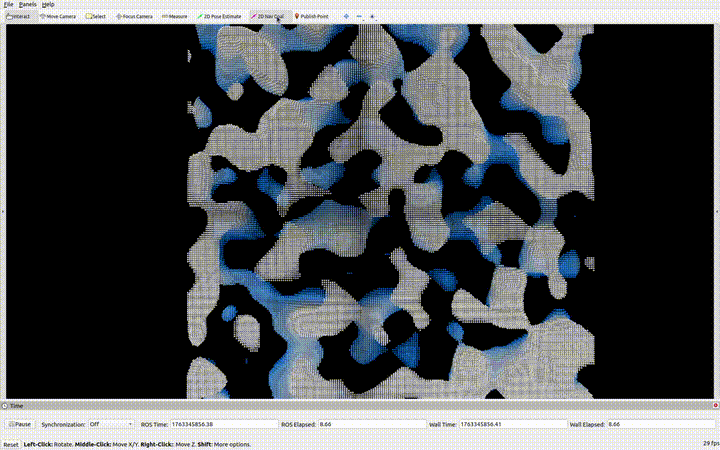
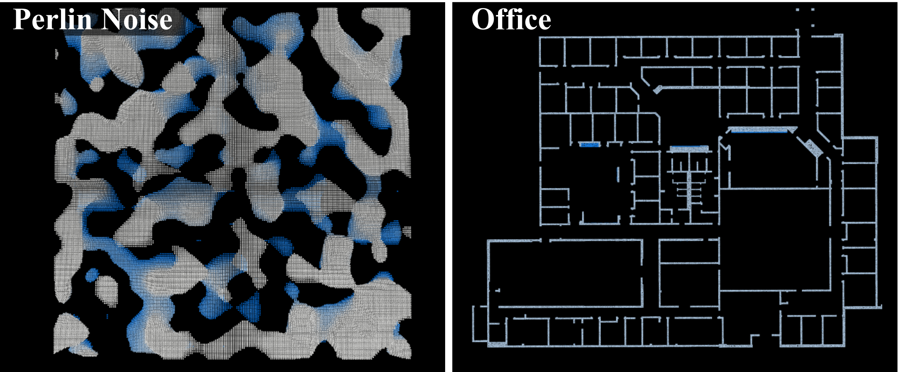

# STITCHER: Constrained Trajectory Planning in Complex Environments with Real-Time Motion Primitive Search

#### [[ArXiv](https://arxiv.org/pdf/2510.14893)] [[Code](https://github.com/vectr-ucla/stitcher.git)]
<!-- #### [[ArXiv]()] [[Video]()] [[Code]()] -->

STITCHER is an optimization-free trajectory planning framework that stitches together motion primitives (i.e. short trajectory segments) to compute long-range, expressive, and near-optimal trajectories in real time. STITCHER has provable performance with guaranteed hard constraint satisfaction and a priori time/memory bounds. The framework has been extensively tested in both simulation and hardware on a custom quadrotor. 


<br>
<p align='center'>
    
</p>

### Dependencies
- Ubuntu 20.04
- [ROS Noetic](http://wiki.ros.org/noetic/Installation) 
- C++ 17
- [catkin tools](https://catkin-tools.readthedocs.io/en/latest/installing.html)
- CMake >= `3.16.3`
- Point Cloud Library >= `1.10.0`
- Eigen >= `3.3.7`
- LibYAML >= `0.6.2`

```sh
sudo apt install python3-catkin-tools cmake libpcl-dev libeigen3-dev libyaml-cpp-dev
```

### Compiling
Create a catkin workspace, clone the `stitcher` repository into the `src` folder, and compile via the [`catkin_tools`](https://catkin-tools.readthedocs.io/en/latest/) package:
```sh
mkdir ws && cd ws && mkdir src && catkin init && cd src
git clone https://github.com/vectr-ucla/stitcher.git
catkin build
```

### Execution
After sourcing the catkin workspace, launch the STITCHER planner ros node. 

```sh
cd ws
source devel/setup.bash
roslaunch stitcher_planner goal_click.launch
```

If successful, RViz will open with the loaded environment. To generate a path, use the 2D Nav Goal tool in RViz to click a start and goal point.

<p align='center'>
    
</p>

### Test Environments

<p align='center'>
    
</p>


We include two test environments in `data`: `perlin_map.pcd`, and `office.pcd` (referred to as Willow Garage in the manuscript). Edit `goal_click.launch` with the environment you would like to test in. 

Note that the office environment requires a smaller resolution for the geometric path planner (e.g. A*, JPS) in order to move through doorways, while the perlin map may use a larger resolution for faster computation of the geometric path. The resolution can be changed in `cfg/params.yaml`.

The following are values that work well. 
- Perlin Noise: `resolution = 0.5`
- Office: `resolution = 0.15`     

## Quadrotor Flight
Our framework was tested on hardware and shown to generate dynamically feasible paths. Below, is one experiment of our quadrotor flying a path generated by STITCHER. 

<br>
<p align='center'>
    
</p>

## Citation
If you found this work useful, please cite our manuscript:

```bibtex
@article{Levy25:STITCHER,
  author={Levy, Helene J. and Lopez, Brett T. },
  journal={ArXiv}, 
  title={STITCHER: Constrained trajectory planning in complex environments with real-time motion primitive search}, 
  year={2025}
}
```
